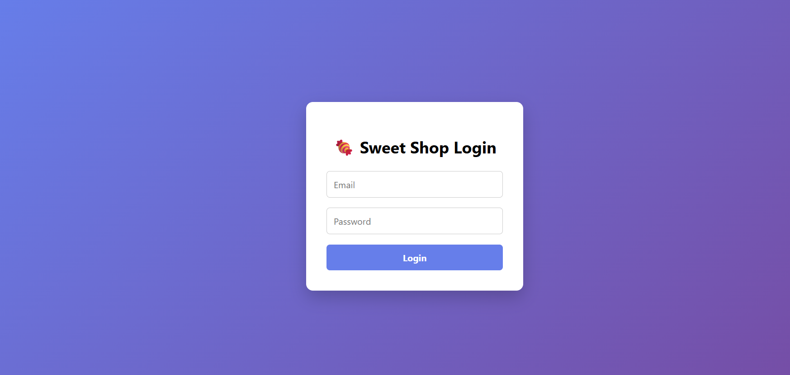
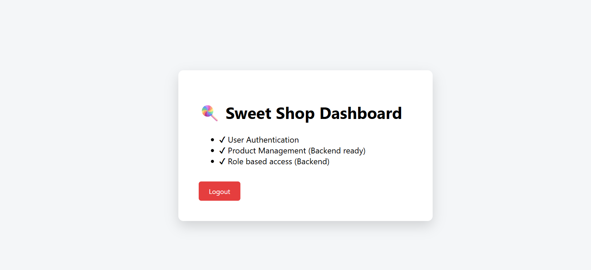

# 🍬 Sweet Shop Management System

A full-stack Sweet Shop Management System built to manage sweets inventory, user authentication, and role-based operations.  
This project is developed as part of a **TDD Kata assignment**, focusing on clean architecture, test-driven development, and responsible AI usage.

---

## 🚀 Features

### 🔐 Authentication
- User Registration & Login
- JWT-based Authentication
- Protected Routes using Tokens
- Role-based access control (Admin/User)

### 🍭 Sweet Management (Protected)
- Add new sweets
- View all available sweets
- Search sweets by name, category, or price range
- Update sweet details
- Delete sweets (Admin only)

### 📦 Inventory Management (Protected)
- Purchase sweets (quantity decreases)
- Restock sweets (Admin only)

---

## 🛠️ Tech Stack

### Backend
- **Node.js**
- **Express.js**
- **MongoDB**
- **JWT Authentication**
- **Jest (for TDD & testing)**

### Frontend
- **React (Vite)**
- **Axios**
- **React Router DOM**
- **Protected Routes**

---

## 📂 Project Structure


sweet-shop-management-system/ │ ├── backend/ │   ├── controllers │   ├── routes │   ├── models │   ├── middleware │   ├── tests │   └── server.js │ ├── frontend/ │   ├── src/ │   │   ├── pages │   │   ├── components │   │   ├── services │   │   └── App.jsx │ └── README.md

---

## ⚙️ Setup Instructions

### 1️⃣ Clone the Repository
```bash
git clone <your-github-repo-link>
cd sweet-shop-management-system


---

2️⃣ Backend Setup

cd backend
npm install
npm run dev

Server runs on: http://localhost:3000

MongoDB must be running locally or via Atlas


---

3️⃣ Frontend Setup

cd frontend
npm install
npm run dev

Frontend runs on: http://localhost:5174


---

🧪 Test Driven Development (TDD)

Tests were written before implementing core business logic

Followed Red → Green → Refactor cycle

Jest used for backend testing

High focus on meaningful test cases


---

📸 Screenshots

Screenshots of the application UI are available in the screenshots/ folder.

Example:





---

🤖 My AI Usage

AI tools were used responsibly during development.

Tools Used

ChatGPT


How I Used AI

Generated initial boilerplate code for frontend and backend

Helped debug authentication and protected route logic

Assisted in structuring README documentation

Brainstormed API endpoint design and folder structure


Reflection

AI significantly improved my development speed and clarity, especially during debugging and structuring the project.
However, all business logic, integration, and final decisions were implemented and validated by me.


---

📌 Git & Version Control

Frequent commits with meaningful messages

Commit history reflects development progression

AI co-authorship added where applicable


Example commit:

git commit -m "feat: Implement JWT-based login authentication

Co-authored-by: ChatGPT <AI@users.noreply.github.com>"


✅ Conclusion

This project demonstrates:

Full-stack development skills

Secure authentication & authorization

Clean coding practices

Test-driven development mindset

Responsible use of AI tools


---

👤 Author

Avinash Kumar
B.Tech Computer Science Student